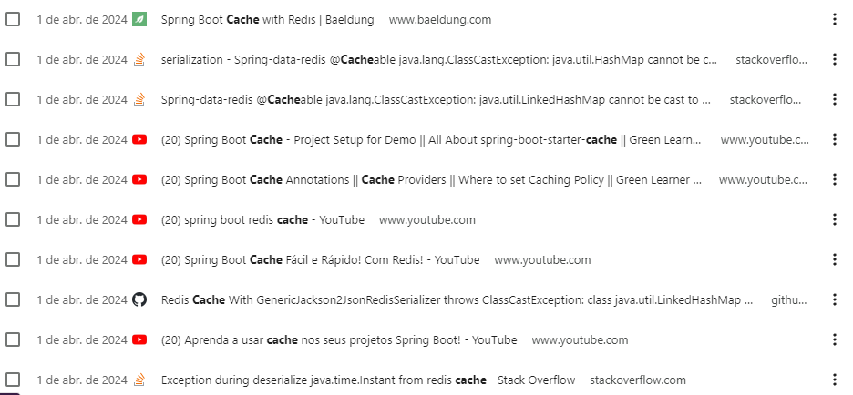

Tentativas de implementar o redis cache:

- Principal problema enfrentado:
  - java.lang.ClassCastException: java.util.HashMap cannot be cast to java.lang.String;
  - Adicionei a importação do spring-boot-starter-data-redis na parte de infra do projeto;
  - Adicionei as configs necessárias pesquisadas e estudadas para serializar/desserializar objs que entravam/saiam do cache;
  - Tive esse problema do ClassCastException, onde:
    - Eu verificava no redis-cli usando os commands key * e get key::id
    - Os objetos estavam sendo inseridos corretamente em cache, ou seja, estavam sendo serializados;
    - Porém, tive dificuldade para desseralizar, 
      o problema java.lang.ClassCastException: java.util.HashMap cannot be cast to java.lang.String
      parece muito comum e polêmico quando se trata de redis com Spring.
    - Para ganhar tempo, fui desenvolvendo outras coisas;
    - Aqui estou eu tentando novamente 
    - Se eu nao conseguir, vou adicionar o padrão do Spring Caching
    - O mecanismo de cache padrão do spring é baseado na impl de ConcurrentMapCache, que mantém os dados em uma estrutura de mapa na memória do aplicativo.
      
  

Testes com Cucumber (IT):

- Eu já tinha ouvido falar do Cucumber mas nunca havia utilizado, para ser sincero, gostei
- Meio que contamos uma história, escrevemos um arquivo .feature e "desenhamos o teste";
- Se meus testes com Cucumber não estiverem muito agradáveis, perdão, estou me acostumando ainda;

Frontend com Angular:

- Eu nunca tinha usado Angular, confesso que eu encontrei algumas dificuldades;
- Até consegui fazer uma coisinha ou outra ali e acredito que se eu não tivesse 
  tantas coisas pra fazer essa semana, eu teria já feito um curso dele e criado tudo bonitinho, porém...
- Percebi que tomaria muito tempo eu desenvolver as telas com Angular essa semana
- Logo, fiz em React mesmo, espero que aceitem e que gostem...
- Caso trabalhemos juntos, estudarei o Angular ou o que for necessário para atender as demandas dos projetos;

JDK:

- Estava tendo alguns problemas de incompatibilidade com a JDK 21, agora que estou mais adiantado 
  no projeto, vou tentar usa-la;

JDBC:

- Como a maioria do pessoal mais novo em Java, eu estava acostumado a usar JPA/Panache & Hibernate para
  gerenciar transacoes no banco, criar as tabelas, realizar as consultas, etc;
- Implementar uma conexao direta e criar as funcoes transacionais usando @Transactional foi legal,
  deu pra lembrar até de um curso que fiz na Udemy quando eu estava começando
- Para gerenciar as migrations eu já estava mais familiarizado a utilizar o Flyway, porém
  eu acho que nem vai ter muito o que eu criar, pois só estou transacionando e gerenciando as
  entidades de Hero e PowerStats nessa aplicacao;